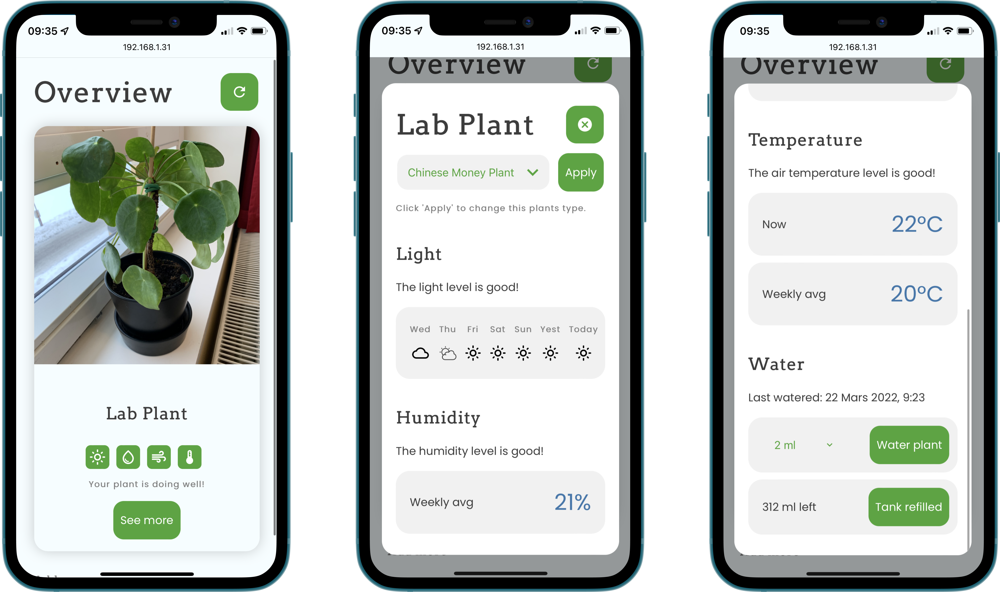

# Plant Watering IOT application!
## Description

This was the final project in the course "Service development and design for the Internet of Things" @ Umeå University. This was a group project, the team consisted of Christoffer Billman, Emmy Lindren, Viktoria Nordkvist and Alex Wahlroos.

The goal of the project was to implement and create an IoT device. Our idea is a plant monitoring system. An ESP-32 was hooked up to several sensors and a water pump, to monitor and water a plant. The ESP-32 then communicates this collected data to a NodeJS server, via MQTT, which then saves this data and presents it through a web interface. The NodeJS server runs on a Raspberry Pi 4.

## Todo list for MWP

-   View data in the "see more" modal. ✅
-   Get the ESP-32 devices up and running with all sensors attatched and working. ✅

## Ideas for further development

If the points in the todo-list are completed, we may persue any of the ideas below:

-   Implement user naming of plants.
-   Add support for several ESP-32 devices, monitoring several plants.
-   Add a end-user system for adding new ESP-32 devices, i.e. without hard coding them in.
